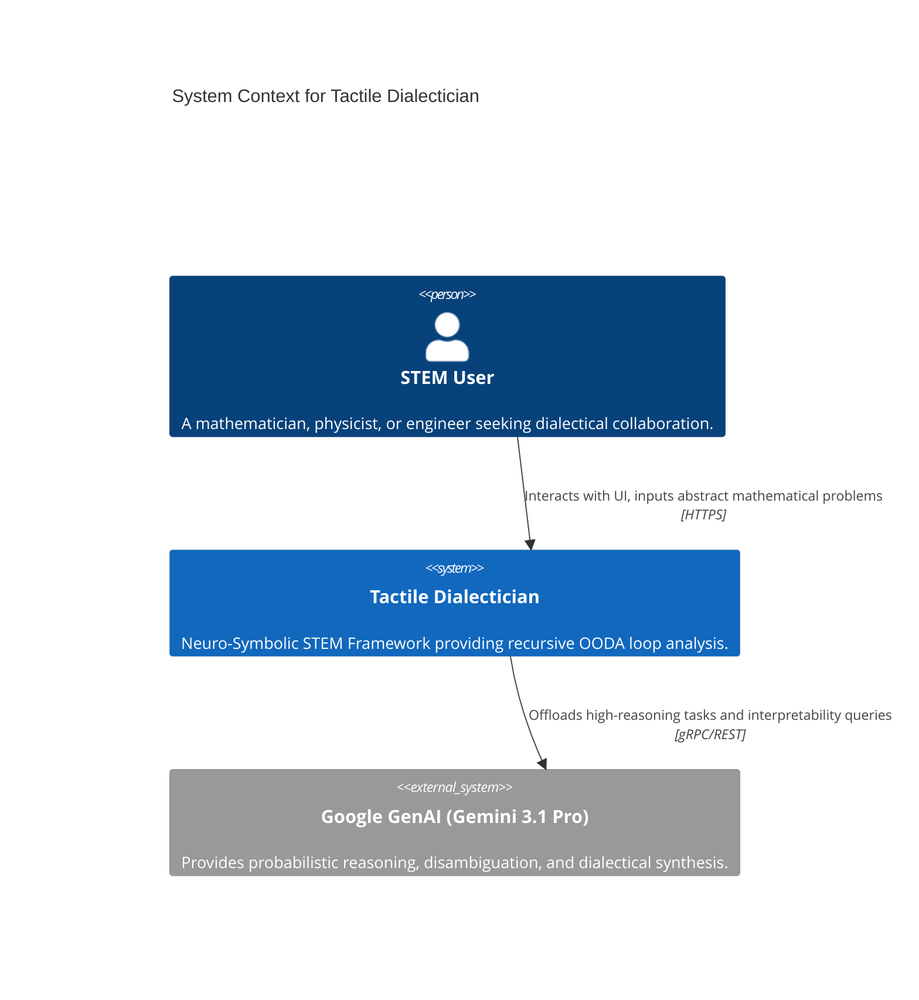
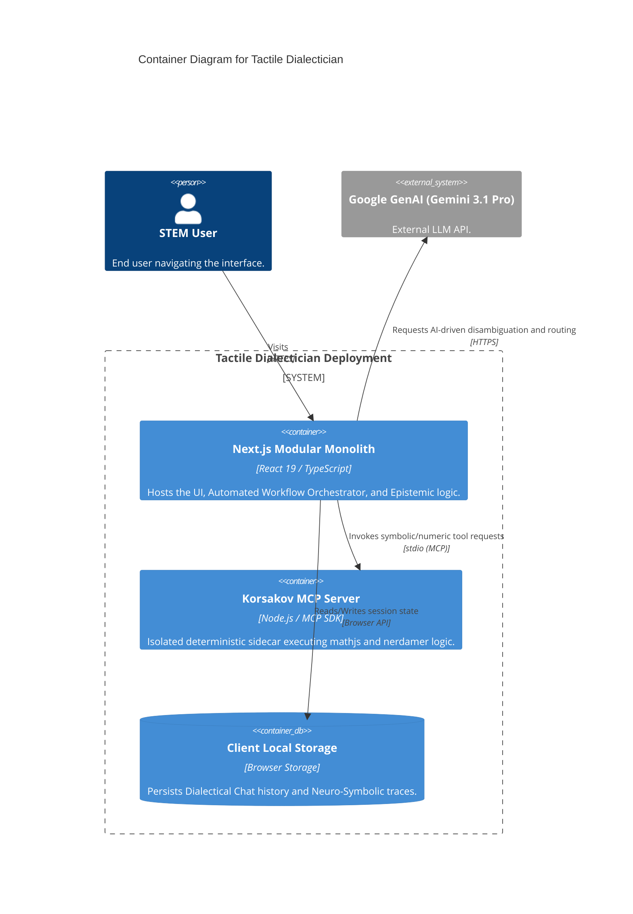
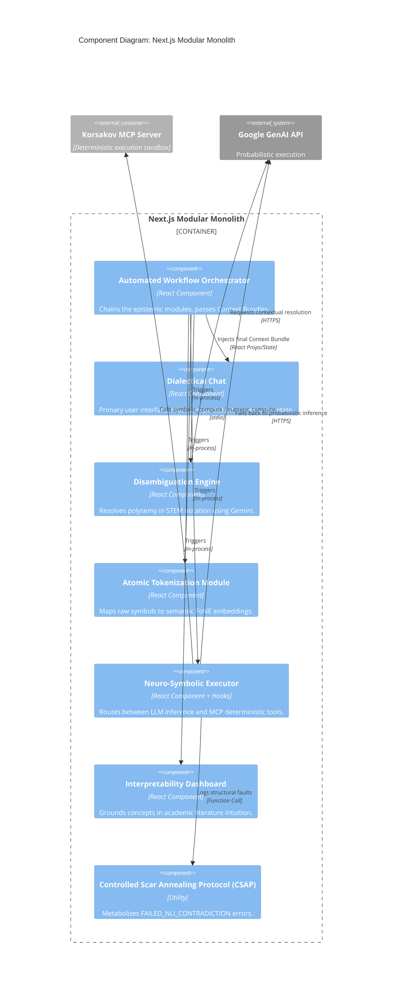

# C4 Model: Tactile Dialectician

## Level 1: System Context
The macro-level view mapping the Tactile Dialectician against its external dependencies.

## Level 2: Container
The physical topography isolating the Next.js Monolith from the Deterministic Sidecar.

## Level 3: Component (Next.js Modular Monolith)
Zooming into the Next.js container to map the internal epistemic modules.

### Lexis Sovereign (Book Co-Author Agent)
*   **Type:** Autonomous Ghostwriting Agent System.
*   **Description:** Implements the Petzold Sequence and Epistemic Matrix to manufacture high-fidelity, voice-invariant long-form text (books) from sparse founder input.
*   **Components:**
    *   **Epistemic Matrix Engine:** Manages voice calibration and boundary condition enforcement (Anionic Architecture).
    *   **DCCD Orchestrator:** Handles the Draft-Conditioned Constrained Decoding two-pass generation system.
    *   **Symbolic Scar Registry:** Persistent vector database (JSONL) tracking historical failures to immunize future generations.
    *   **Review Critic:** Adversarial validation agent ensuring VMS and CFDI metrics are met.
