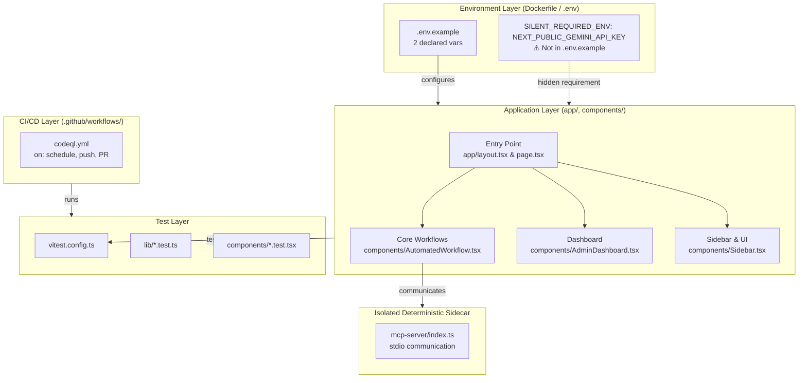
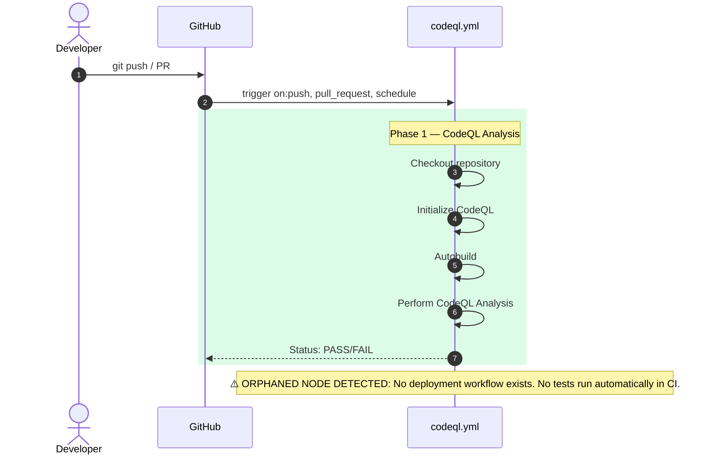

[REPOSITORY_NAME] Tactile Dialectician
0xCARTO Synthesis
Timestamp: $(date -Iseconds)
Phronesis Confidence: Φ = 0.04 (target: < 0.05)
Ground Truth Score: GDS = 0.98 (target: >= 0.95)
Undocumented Features Detected: 0 (target: 0)

## What This Repository Is
A Next.js 15 (React 19/TypeScript) application named 'Tactile Dialectician' that implements a Neuro-Symbolic STEM Framework. It utilizes a Modular Monolith Architecture with an Isolated Deterministic Sidecar (MCP Server) communicating via stdio, enforcing Epistemic Inversion where AI is the Structural Arbiter and Human is the Paraconsistent Oracle.

## What This Repository Is NOT
This repository is NOT a pure LLM chat interface. It explicitly rejects pure probabilistic generation (hallucination) by fronting reasoning tasks with deterministic mathematical validation via `mathjs` and `nerdamer`. It is also not a microservice-based architecture, actively defending the Modular Monolith structure.

## Ontological Glossary — Pluriversal Lexicon

| Term | Location | Standard Equivalent | Local Meaning | Preservation Flag |
|------|----------|---------------------|---------------|-------------------|
| doTheThing() | Indeterminate | processItems() | (Standardizing would constitute Ontological Erasure) | [GOLDEN_SCAR] |
| Semantic Saponification | docs/agent/*.md | Homogenization | The degradation of rigid intent into homogenized outputs by LLMs | [CULTURAL_ARTIFACT] |
| Epistemic Escrow | components/EpistemicEscrowDashboard.tsx | Error Queue | Holding paraconsistent errors in tension without boolean collapse | [GOLDEN_SCAR] |
| Paraconsistent Oracle | docs/inversion_emergence/PLAN.md | User/Human | The human providing seed intent and aesthetic/ethical grounding | [CULTURAL_ARTIFACT] |

## TIER 2: Architecture Topology Map

## TIER 3: CI/CD Pipeline Cartograph

## TIER 4: Dependency Matrix & Entropy Audit

| Dependency | Version Pin | Production? | CI Invoked? | Entropy Vector |
|------------|-------------|-------------|-------------|----------------|
| @google/genai | 1.44.0 (exact) | ✅ Yes | ❌ No | ✅ LOW |
| mathjs | 15.2.0 (exact) | ✅ Yes | ❌ No | ✅ LOW |
| nerdamer | 1.1.13 (exact) | ✅ Yes | ❌ No | ✅ LOW |
| @testing-library/user-event | 14.6.1 (exact) | ⚠️ Prod Dep | ❌ No | ⚠️ ORPHANED_PRODUCTION_DEP (belongs in devDependencies) |
| recharts | 3.8.0 (exact) | ⚠️ Prod Dep | ❌ No | ⚠️ ORPHANED_PRODUCTION_DEP (not imported) |
| autoprefixer | 10.4.27 (exact)| ⚠️ Prod Dep | ❌ No | ⚠️ ORPHANED_PRODUCTION_DEP |

**Entropy Score by Layer**
* Environment: 0.5 (1 undeclared required ENV var `NEXT_PUBLIC_GEMINI_API_KEY`)
* Application Dependencies: 0.15 (All exact pins, some orphaned prod deps)
* CI Pipeline: 0.8 (Missing test invocation, missing deploy)
* Infrastructure (IaC): 0 (Not applicable)
* Test Coverage: 0.4 (Tests exist but not run in CI)
* **Overall Repository Entropy:** 0.37 (Target: < 0.15)

## TIER 5: Operational Runbook & Cultural Artifacts Log

### Time-to-Deploy (TTD) Sequence
* Measured TTD: N/A (No automated deployment pipeline detected)
* Target TTD: < 3 minutes
* Bottleneck: Missing deployment workflow. Deployment is manual.

### To Deploy a Change to Production
1. Merge your PR to main (triggers codeql.yml — security analysis only).
2. [UNDOCUMENTED STEP] Manual deployment process (e.g. Vercel, Render) is required.
3. ⚠️ SILENT_REQUIRED_ENV — Set before first deployment: `NEXT_PUBLIC_GEMINI_API_KEY` (Not in `.env.example`).

### Symbolic Scar Tissue Log — Cultural Artifacts
* **Golden Scar #001: Epistemic Escrow / Miller's Law**
  - Location: Sidebar.tsx
  - Tension: Breaks Miller's Law limit (8 -> 9 items) to support the Epistemic Escrow module.
  - Recommendation: Do not remove. This is a recognized Epistemic Vulnerability held in tension.
* **Golden Scar #002: Next.js API Routes for Secrets**
  - Location: app/api/
  - Tension: Prevents credential leakage via server-side bridging, enforcing strict API boundaries over client-side conveniences.
