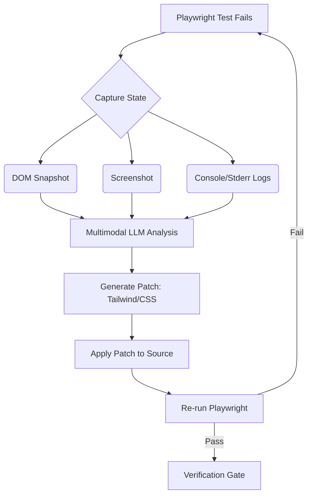

# Automated Multimodal UI Verification Harness (Agent-Driven Playwright Loop)

**Artifact Status:** PROPOSED
**Author:** Principal QA Automation Engineer & Vision-ML Specialist
**Domain:** Automated Visual QA, Computer Vision, & Layout Grading

## Overview

This blueprint defines an automated, self-healing visual testing harness. It leverages a multimodal LLM to parse hand-drawn sketches or design PDFs, translate them into executable Playwright tests, and run a self-correcting TDD loop to iteratively repair layout and styling defects based on DOM state and screenshot feedback.

---

## 1. Test-Driven Visual Spec Pipeline

The process begins by converting informal multimodal intent into a deterministic, executable specification.

### Flow
1.  **Input:** Human provides a sketch, wireframe, or PDF design card.
2.  **Multimodal Parsing:** The vision model analyzes the asset, extracting components, hierarchical layout, colors, typography, and intended interactions.
3.  **Spec Generation:** The agent translates the parsed design into a type-safe Playwright script utilizing standard matchers (e.g., `expect(locator).toHaveCSS()`, bounding box checks).

### Example JSON-RPC Payload: `generate_visual_spec`
```json
{
  "method": "vqa.generate_visual_spec",
  "params": {
    "design_asset_url": "s3://assets/login_wireframe_v2.png",
    "target_component": "LoginForm",
    "viewport": { "width": 1280, "height": 720 }
  },
  "id": "1"
}
```

### Generated Playwright Output (The Baseline Failure)
The agent generates a strict test that enforces spatial layout and visual semantics:
```typescript
test('LoginForm layout matches visual spec', async ({ page }) => {
  await page.goto('/login');

  const submitButton = page.getByRole('button', { name: 'Sign In' });

  // Visual semantic checks
  await expect(submitButton).toHaveCSS('background-color', 'rgb(0, 102, 255)');
  await expect(submitButton).toHaveCSS('border-radius', '8px');

  // Spatial checks (Bounding box relative positioning)
  const box = await submitButton.boundingBox();
  expect(box.width).toBeGreaterThanOrEqual(120);
});
```

---

## 2. Automated Layout Grading & Code Repair (The Self-Healing Loop)

If the baseline test fails (e.g., the button is the wrong color or misaligned), the harness enters the repair cycle.

### The Feedback Vector
When Playwright encounters an assertion failure, the harness captures:
*   **Structured Error Log:** `AssertionError: expected 'rgb(255, 0, 0)' but got 'rgb(0, 102, 255)'`.
*   **High-Res Screenshot:** A capture of the failing component state.
*   **DOM Snapshot:** The isolated HTML/CSS tree of the failing component.

### Multimodal ReAct Loop
1.  **Observe:** The vision-enabled model receives the error, screenshot, and DOM snippet.
2.  **Grade:** It identifies the delta between the desired visual spec and the actual rendered state.
3.  **Act:** It generates structured CSS/Tailwind modifications to resolve the misalignment.
4.  **Execute:** The harness applies the fix and re-runs the Playwright test.

### Agent Workflow Diagram


---

## 3. Verification, Checkpointing, and Rollback

Visual regression is high risk. The system must employ strict checkpointing.

### Atomic Filesystem Snapshots
Before applying any AI-generated patch to a UI component (e.g., a `.tsx` file), the harness utilizes Git stashing or atomic file copies to record the prior state.

### The Rollback Mechanism (`/restore`)
If the self-healing loop exceeds `max_iterations` without satisfying the visual spec, or if the layout drifts significantly (measured via pixel-diffing algorithms like Resemble.js between iterations), the harness automatically triggers a rollback.

### JSON-RPC Tool Definition: `apply_layout_patch`
```json
{
  "name": "apply_layout_patch",
  "description": "Applies CSS/HTML modifications to a specific component. Automatically creates an atomic rollback snapshot before mutation.",
  "parameters": {
    "type": "object",
    "properties": {
      "file_path": { "type": "string", "description": "Target component file path" },
      "patch_content": { "type": "string", "description": "The exact source code modifications" },
      "create_snapshot": { "type": "boolean", "default": true }
    },
    "required": ["file_path", "patch_content"]
  }
}
```

By coupling deterministic Playwright layout assertions with multimodal visual grading and strict rollback safeguards, this harness bridges the gap between semantic code logic and subjective visual rendering.
