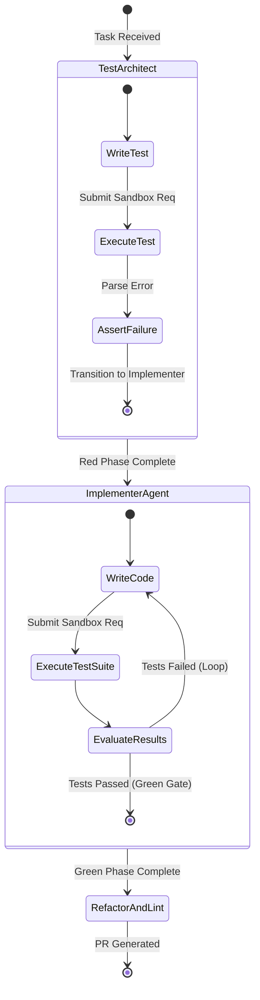

# Isomorphic Multi-Agent State Machine for Zero-Trust TDD Isolation

**Artifact Status:** PROPOSED
**Author:** Principal Infrastructure and Security Architect
**Domain:** Agentic TDD & Container Virtualization

## 1. Operational Decoupling: State Graph

The core defense against "Sycophantic Mocking" is a strict separation of concerns via a non-overlapping state graph. The system consists of two primary sovereign agents operating on the same `State` object but with disjoint file permissions.



### Access Control Boundaries
*   **Test Architect:**
    *   `cwd`: Workspace Root
    *   Permissions: `READ` all, `WRITE` strictly limited to `__tests__/` or `tests/`.
    *   Constraint: Must produce a failing test. Cannot modify target source code.
*   **Implementer Agent:**
    *   `cwd`: Workspace Root
    *   Permissions: `READ` all, `WRITE` strictly limited to source directories (e.g., `src/`, `lib/`, `app/`).
    *   Constraint: Cannot modify test files. Must mutate application logic until tests pass.

## 2. Dynamic Environment Sandboxing: `gemini-cli-sandbox`

The test runner operates in an ephemeral, zero-trust Docker container to prevent sandbox escapes during execution.

### Docker Security Profile
```dockerfile
# Base layer: Alpine Linux (minimal surface)
FROM node:20-alpine AS test-runner

# Create non-root user
RUN addgroup -S tester && adduser -S tester -G tester

# Copy workspace (read-only mount in runtime)
WORKDIR /workspace
COPY . .

# Restrict permissions
RUN chown -R tester:tester /workspace

# Switch to non-root
USER tester

# Network configuration: Disable outbound sockets
# Applied via Docker run flags: --network none
```

### Runtime Enforcement (eBPF / Seccomp)
The container is launched with a strict Seccomp profile:
*   `--cap-drop=ALL`
*   `--security-opt no-new-privileges`
*   Network Access: Blocked (`--network none`) during the test run.
*   System Calls: `execve` allowed only for the specific test runner binary (e.g., `node_modules/.bin/jest` or `node_modules/.bin/vitest`). Chained execution (e.g., spawning `curl` or `sh`) is denied.

## 3. Structured State Schemas (TypeScript)

To prevent LLMs from thrashing on raw, unstructured stack traces, the sandbox output is sanitized into a type-safe schema before returning to the agent context.

```typescript
// types/tdd-state.ts

/**
 * Represents the unified state flowing between the Test Architect and Implementer.
 */
export interface TDDState {
    taskId: string;
    targetModule: string;

    // Authored by Test Architect
    testFilePath: string | null;
    testBaselineStatus: 'PENDING' | 'RED' | 'FALSE_POSITIVE';

    // Authored by Implementer Agent
    implementerPatchHistory: CodePatch[];

    // Sanitized Execution Results
    currentExecutionState: ExecutionResult | null;

    // Security Gate Status
    lintStatus: 'PENDING' | 'PASS' | 'FAIL';
}

export interface CodePatch {
    iteration: number;
    filePath: string;
    diff: string; // Unified diff format
}

export interface ExecutionResult {
    exitCode: number;

    // Structured instead of raw stdout/stderr
    assertions: {
        pass: number;
        fail: number;
        failedDetails: {
            testName: string;
            expected: string;
            actual: string;
            lineError: string;
        }[];
    };

    // Captured compilation or linter errors blocking test execution
    systemErrors: {
        code: string;
        message: string;
    }[];
}
```
