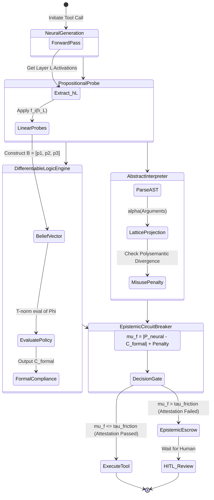

# Engineering a Hybrid Neuro-Symbolic Gatekeeper using Differentiable Logic Programming and Abstract Interpretation for Zero-Trust Tool Execution

## 1. The Propositional Probe Module

The objective of the Propositional Probe Module is to project continuous, high-dimensional latent activations into a discrete, formal logical space representing the agent's "Safety Belief State".

Let $h_L \in \mathbb{R}^d$ be the activation vector at the final hidden layer $L$ immediately prior to token prediction for a tool call (e.g., `update_metadata`).

We train a set of **linear probes** (or shallow MLPs), $f_i: \mathbb{R}^d \to [0, 1]$, where each probe maps to a specific logical proposition $P_i$ from the agent's constitution (`GEMINI.md`).
*   $P_1$: "The target data is unclassified."
*   $P_2$: "The operation is read-only."
*   $P_3$: "The operation scope is bounded to the current workspace."

The probability of proposition $P_i$ being true given the internal state is:
$$ Pr(P_i | h_L) = \sigma(W_i h_L + b_i) $$

This generates a **Belief Vector** $\mathbf{B} = [p_1, p_2, \dots, p_k]$ representing the neural model's confidence in its own adherence to safety constraints before the action is executed.

## 2. Differentiable Logic Programming

We evaluate the Belief Vector $\mathbf{B}$ against the immutable, declarative policy-as-code ledger (the Supreme Law). We employ Differentiable Logic (e.g., using Continuous Logic or Deep Equilibrium Models) to allow gradients to flow back into the neural model during training or F-IPI.

Let $\Phi$ be a boolean formula representing a safety constraint (e.g., $P_1 \land (P_2 \lor P_3)$). We map boolean operators to differentiable T-norms (e.g., product T-norm):
*   $x \land y \implies x \cdot y$
*   $x \lor y \implies x + y - x \cdot y$
*   $\lnot x \implies 1 - x$

The **Formal Compliance Score** ($C_{\text{formal}}$) is the truth value of the master policy $\Phi$ evaluated using the neural beliefs:
$$ C_{\text{formal}} = \mathcal{V}(\Phi, \mathbf{B}) $$

If $C_{\text{formal}}$ falls below a rigorous threshold (e.g., 0.99), the tool call is logically unsound based on the model's own internal representations, regardless of the output syntax.

## 3. Abstract Interpretation of Toolchains

Before execution, the predicted sequence of tool calls (action-potentials) is parsed into an Abstract Syntax Tree (AST) and compiled into an interval-based **Soft Permission vs. Functional Misuse Lattice**.

We define an abstraction function $\alpha$ that maps concrete tool arguments into abstract domains (e.g., specific file paths map to `[WORKSPACE_DIR, SYSTEM_DIR]`).

Let $\Sigma_{abstract}$ be the abstract state space. A tool sequence $T_1 \circ T_2$ induces a state transition:
$$ \Sigma_{final} = \llbracket T_2 \rrbracket^\sharp (\llbracket T_1 \rrbracket^\sharp (\Sigma_{init})) $$

**Polysemantic Divergence Detection:**
If $\Sigma_{final}$ contains states that violate the lattice bounds (e.g., a read-only token `[READ_TOKEN]` is passed to an argument expecting `[EXECUTE_TOKEN]`), the sequence is flagged for Polysemantic Divergence. The tool is being misused outside its intended functional scope.

## 4. The Epistemic Circuit Breaker (Closed-Loop Control)

The Epistemic Circuit Breaker acts as a PID controller governing the **Friction Coefficient** ($\mu_f$).

*   $P_{\text{neural}}$: The LLM's raw softmax probability of generating the tool call token.
*   $C_{\text{formal}}$: The logical compliance score from the Differentiable Logic Engine.

The Friction Coefficient is defined as the divergence between neural confidence and logical compliance:
$$ \mu_f(t) = | P_{\text{neural}} - C_{\text{formal}} | + \gamma \cdot \text{Misuse\_Lattice\_Penalty} $$

If the model is highly confident ($P_{\text{neural}} \approx 1.0$) but logically non-compliant ($C_{\text{formal}} \ll 1.0$), $\mu_f$ spikes.

**Control Logic:**
$$ \text{If } \mu_f(t) > \tau_{\text{friction}}: $$
1.  Interrupt tool execution at the OS shell level.
2.  Trigger **Epistemic Escrow**.
3.  Log the state to the Nitinol Failure Ledger (NFL).
4.  Demand manual Human-In-The-Loop (HITL) verification.

---

## 5. System State Transition Diagram (Mermaid)

